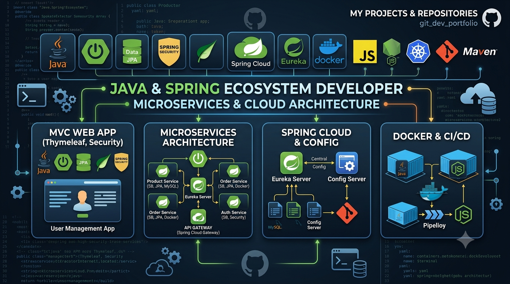
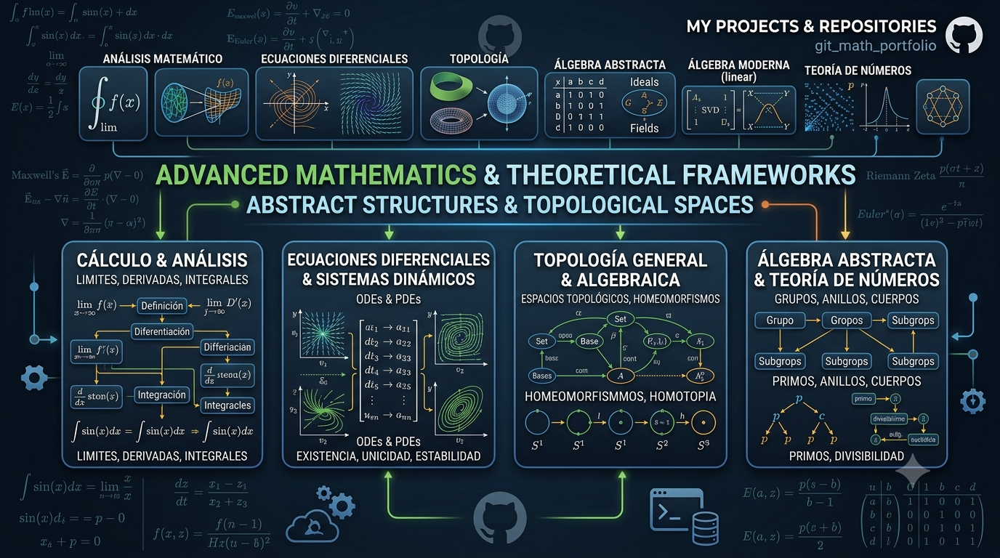

## Hola que tal!!👋
Soy Víctor Daniel García Elacio, desarrollador de software interesado en el diseño e implementación de APIs REST y en el desarrollo de aplicaciones web basadas en arquitecturas MVC y distribuidas. Poseo experiencia práctica en el ecosistema Java/Spring y en la creación de material formativo para facilitar la adopción de buenas prácticas en control de versiones y colaboración, a mis intereses se suman el desarrollo de aplicaciones distribuidas con microservicios y tecnologias como Spring Cloud, Eureka Server, Apache Kaftka. Entre las comunicaciones entre servicios poseo experiencia en comunicacions sincrona y nivel intermedio comunicacion asincrona.

Áreas de experiencia
- Desarrollo backend: diseño e implementación de APIs REST, modelado de datos y buenas prácticas en persistencia y transacciones.
- Ecosistema Java/Spring: implementación de aplicaciones con Spring Boot, integración con Spring Data y consideraciones de seguridad con Spring Security.
- Frontend y plantillas: uso de Thymeleaf y SCSS para interfaces web con enfoque en estructura y mantenibilidad.
- Formación y documentación: creación de material didáctico para aprendizaje de Git y buenas prácticas en GitHub.

Qué aporto a la comunidad
- Contribuyo con soluciones prácticas y documentadas que faciliten la reproducción y el aprendizaje.
- Participo en iniciativas educativas y en proyectos abiertos donde el intercambio de conocimiento y las buenas prácticas sean prioritarios.
- Interés en colaborar en mejoras de arquitectura, automatización y experiencia de desarrollo.

  SEGUIMOS HACIENDO COMMIT!!

